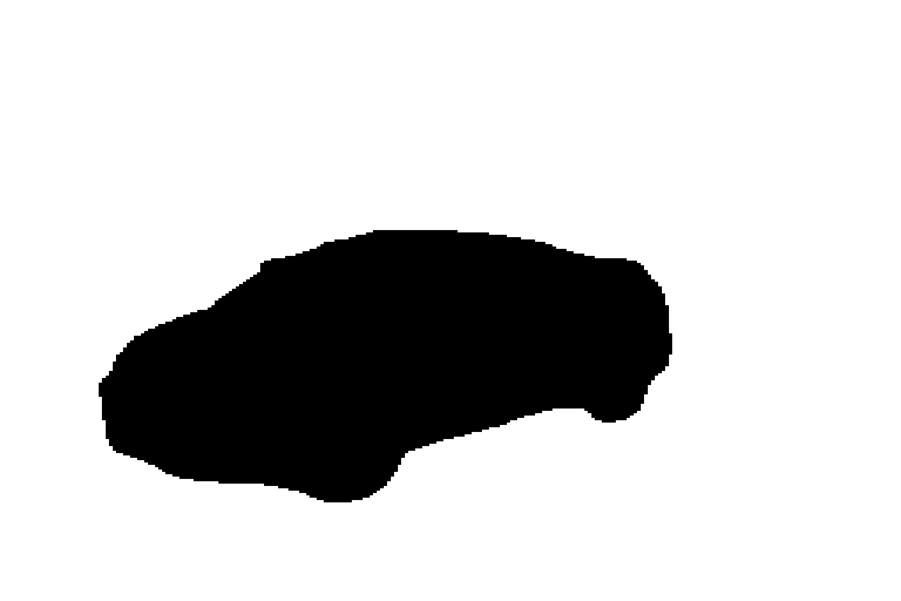

# U-Net Implementation

This repository contains an implementation of the U-Net architecture for image segmentation tasks specifically trained on the Carvana dataset from Kaggle. The U-Net is a convolutional neural network that was developed for biomedical image segmentation. The network is based on the fully convolutional network and its architecture was modified and extended to work with fewer training images and to yield more precise segmentations.
## Image Segmentation Example

Below is an example of the image segmentation process on a sample car image from the Carvana dataset:

| Before (Input Image) | After (Segmented Output) |
|:--------------------:|:------------------------:|
|  |  |

The image on the left is the original input image. The image on the right shows the segmentation mask produced by our U-Net model, where the car is separated from the background.
## Model Performance

Below is the performance of our trained U-Net model on the Carvana dataset:-


## Repository Structure

- `download_data.py`: Script for downloading the dataset.
- `split_data.py`: Script for splitting the data into training, testing and validation sets.
- `train.py`: Script for training the U-Net model.
- `predict.py`: Script for making predictions using the trained model on custom input.
- `requirements.txt`: File listing all the Python dependencies for this project.


## Getting Started


### Installation

1. Clone the repository:
   ```
   git clone https://github.com/arulkumarann/u_net_implementation.git
   cd u_net_implementation
   ```

2. Install the required packages:
   ```
   pip install -r requirements.txt
   ```

## Usage

### Downloading the Data

To download the dataset, run:

```
python download_data.py
```

### Splitting the Data

To split the data into training and validation sets, run:

```
python split_data.py
```

### Training the Model

To train the U-Net model, run:

```
python train.py
```

This script will train the model and save its performance metrics.

### Making Predictions

To make predictions using the trained model, you need to modify the paths in the `predict.py` file:

1. Open `predict.py` in a text editor.
2. Locate the following lines:
   ```python
   input_image_path = r"/teamspace/studios/this_studio/u_net_implementation/data/test/test/0a0e3fb8f782_02.jpg"
   model_path = r"/teamspace/studios/this_studio/u_net_implementation/checkpoints/unet_checkpoint.pth"
   output_image_path = r"/teamspace/studios/this_studio/u_net_implementation/predictions/prediction_output.png"
   ```
3. Change these paths to match your local setup:
   - `input_image_path`: Path to the car image you want to segment.
   - `model_path`: Path to your trained model checkpoint.
   - `output_image_path`: Path where you want to save the prediction output.

4. Save the changes to `predict.py`.

5. Run the prediction script:
   ```
   python predict.py
   ```

The script will use the specified input image, load the model from the given checkpoint, make a prediction, and save the result to the specified output path.


## Acknowledgments

- The original U-Net paper: [U-Net: Convolutional Networks for Biomedical Image Segmentation](https://arxiv.org/abs/1505.04597)
- Carvana Image Masking Challenge on Kaggle: [Link](https://www.kaggle.com/c/carvana-image-masking-challenge)
